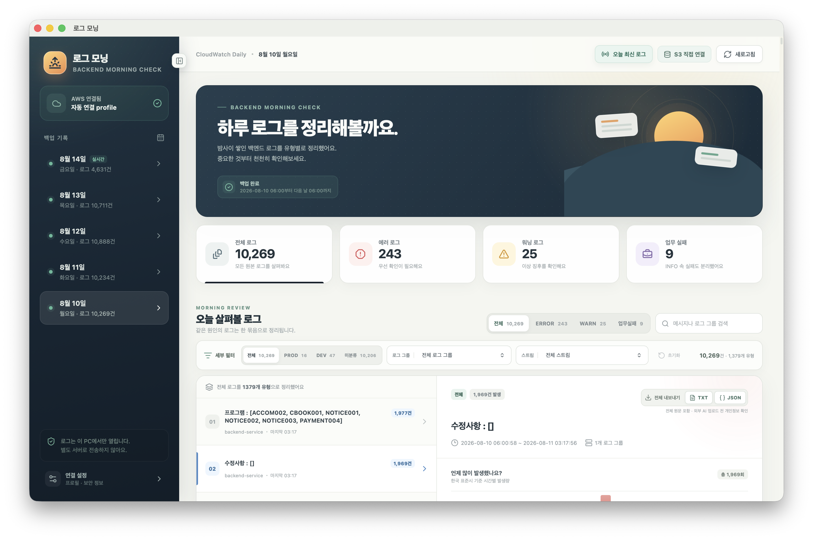
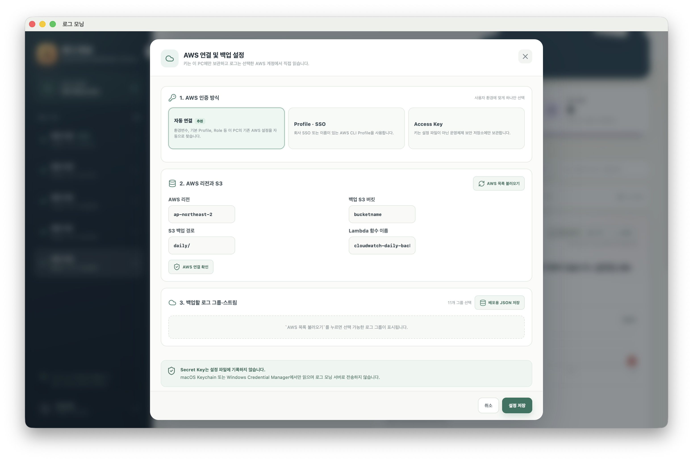

# 로그 모닝

[](https://github.com/SweepHee/log-morning-cloudwatch-desktop/releases/latest)
[](https://github.com/SweepHee/log-morning-cloudwatch-desktop/actions/workflows/release.yml)

CloudWatch 로그를 사용자의 AWS 계정 안에서 S3로 일일 백업하고, 다음 날 아침에 로컬 데스크톱 앱으로 확인하는 도구입니다.

특정 회사의 AWS 계정·버킷·로그 그룹에 종속되지 않으며, 별도 로그 분석 서버를 운영하지 않습니다.

## 다운로드

최신 macOS·Windows 설치 파일은 [GitHub Releases](https://github.com/SweepHee/log-morning-cloudwatch-desktop/releases/latest)에서 받을 수 있습니다.

- Apple Silicon Mac: `aarch64` DMG
- Intel Mac: `x86_64` DMG
- Windows 64비트: `.exe` 또는 `.msi` 설치 파일

현재 설치 파일은 공인 코드 서명·공증 전이므로 macOS Gatekeeper 또는 Windows SmartScreen 경고가 표시될 수 있습니다. 소스와 GitHub Actions 빌드 내역을 확인한 뒤 설치하세요.

## 화면 미리보기

### 로그 대시보드



### AWS 연결 및 백업 설정



## 동작 방식

```text
선택한 CloudWatch 로그 그룹/스트림
  → 사용자의 Lambda (매일 06:00 Asia/Seoul)
  → 사용자의 비공개 S3 버킷
  → 사용자의 로그 모닝 데스크톱 앱
```

- 별도 로그 분석 서버를 운영하지 않습니다.
- 로그와 AWS 자격 증명은 사용자의 PC와 AWS 계정 밖으로 전송하지 않습니다.
- 백업 Lambda는 업무 요청을 처리하지 않습니다. 더 이상 필요 없으면 CloudFormation 스택을 삭제해도 서비스에는 영향이 없고, 이후 백업만 중단됩니다.

## AWS 인증 방식

앱은 아래 순서의 연결 방식을 지원합니다.

1. 자동 연결: 환경 변수, 기본 AWS Profile, EC2/ECS Role 등 AWS SDK 기본 자격 증명 체인
2. Profile · SSO: 회사에서 사용하는 AWS CLI Profile 또는 IAM Identity Center(SSO) Profile
3. Access Key: macOS Keychain 또는 Windows Credential Manager에만 저장

Secret Access Key는 앱 설정 파일·로그·S3에 기록하지 않습니다. Access Key를 직접 입력하는 경우에도 앱의 Rust 백엔드가 운영체제 보안 저장소로 바로 보관합니다.

## 필요한 AWS 권한

앱의 설정 화면에서 AWS 리소스를 조회하려면 다음 권한이 필요할 수 있습니다.

- `sts:GetCallerIdentity`
- `s3:ListAllMyBuckets` (버킷 선택 목록을 불러올 때만)
- `s3:HeadBucket`, `s3:ListBucket`, `s3:GetObject` (백업 확인)
- `logs:DescribeLogGroups`, `logs:DescribeLogStreams` (선택 목록을 불러올 때만)
- `lambda:InvokeFunction` (오늘 로그 갱신 기능)

Lambda 배포 권한은 별도입니다. 앱에 관리자 Access Key를 장기 저장하지 말고, 배포할 때 AWS 콘솔 또는 AWS CLI의 Profile/SSO 자격 증명으로 CloudFormation을 승인하는 방식을 권장합니다.

## 로컬 실행

```bash
npm ci
npm run tauri dev
```

테스트와 프로덕션 프론트 빌드:

```bash
npm test
npm run build
cargo test --manifest-path src-tauri/Cargo.toml
```

## 릴리스 자동화

`v0.1.0`처럼 `v`로 시작하는 태그를 푸시하면 GitHub Actions가 다음 설치 파일을 빌드해 같은 버전의 GitHub Release에 자동 첨부합니다.

- macOS Apple Silicon
- macOS Intel
- Windows x64

워크플로는 저장소가 실행할 때만 발급되는 최소 범위의 `GITHUB_TOKEN`을 사용하며 AWS 키를 요구하지 않습니다.

## 백업 Lambda 배포

`infrastructure/cloudwatch-backup/` 폴더에 범용 Lambda, CloudFormation 템플릿, 배포 스크립트가 있습니다.

가장 쉬운 방법은 앱 설정의 **4. 백업 Lambda 자동 설치**에서 설치 버튼을 누르는 것입니다.
앱은 계정·리전마다 `log-morning-cloudwatch-backup` CloudFormation 스택 하나만 사용합니다.
버튼을 여러 번 눌러도 Lambda가 중복 생성되지 않고 기존 스택만 업데이트됩니다.

자동 설치에는 최초 1회 CloudFormation·IAM·Lambda·EventBridge Scheduler 생성 권한과
선택한 S3 버킷에 Lambda 코드를 업로드할 권한이 필요합니다. 회사 계정에서는 관리자
승인이 필요할 수 있습니다.

터미널 배포는 자동 설치를 사용할 수 없는 환경을 위한 대체 방법입니다.

앱의 **설정 → 3. 백업할 로그 그룹·스트림 → 배포용 JSON 저장**으로 현재 선택을
`log-sources.json`으로 내보낼 수 있습니다. 이 파일에는 실제 로그 그룹·스트림 이름이
들어갈 수 있으므로 `.gitignore` 처리되어 있으며 공개 저장소에 올리지 마세요.

```bash
cd infrastructure/cloudwatch-backup
cp log-sources.example.json log-sources.json
# log-sources.json에서 백업할 로그 그룹과 선택적 스트림을 수정
./deploy.sh \
  --region ap-northeast-2 \
  --bucket my-private-log-backup-bucket \
  --sources-json ./log-sources.json \
  --profile my-company-sso
```

배포 스크립트는 선택한 로그 그룹 ARN만 Lambda 역할에 `logs:FilterLogEvents` 권한으로 부여합니다. 로그 그룹을 추가·제거하려면 JSON을 수정한 뒤 같은 명령을 다시 실행하면 됩니다.

## 배포 시 주의

- 개인 정보·고객 식별자가 포함된 샘플 로그와 AWS 식별자를 넣지 않습니다.
- `LICENSE`는 아직 의도적으로 추가하지 않았습니다. 소스 재사용을 허용하려면 별도 라이선스를 결정해야 합니다.
- macOS 외부 배포에는 Developer ID 서명·공증, Windows 외부 배포에는 코드 서명을 권장합니다.
